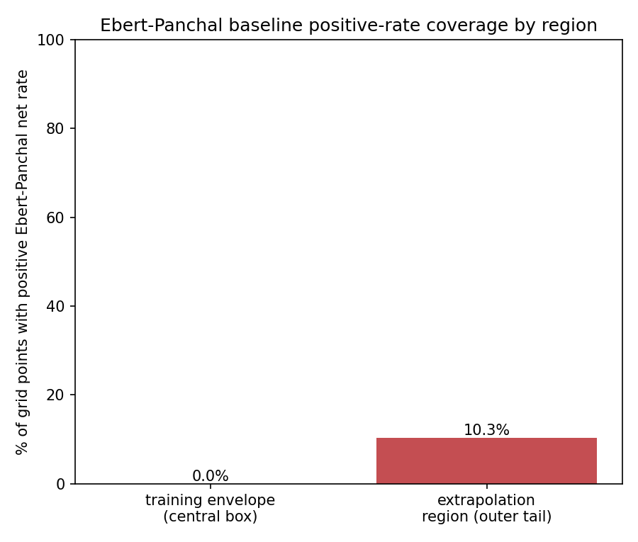

# Results
<!-- claims: C1 -->

This section reports the preregistered checks and decisions from
`docs/sections/03-methods.md`, applied to the single completed run
`run:fouling-benchmark-2026-09-13` (manifest:
`data/processed/fouling-benchmark-2026-09-13.manifest.json`, config:
`data/raw/fouling-benchmark-config.json`). The run reproduces byte-for-byte
under `scripts/rerun_manifest.py --all`. All reported RMSE values are scored
against the noisy held-out targets (`target_basis: noisy`), not the clean
latent simulator output.

## Data, mapping, and preregistered gates

The latent grid comprises the preregistered 45×45 = 2,025 operating points.
Before any noise or training step, the run passed both preregistered gates:
the induction transition occurred within the 30-day horizon at 100% of grid
points (required: a nontrivial fraction), and the positive-range gate held
(`max R_f(H) - min R_f(H) = 7.4324` in native resistance units, native-unit
noise standard deviation `sigma = 0.1486`, i.e. 2% of that range).

## C0: transcription/unit/input-mapping alarm

The preregistered precedence rule requires checking, before any other C0
decision, whether the median residual-free (Ebert–Panchal-only) noisy-target
extrapolation RMSE exceeds the black-box median extrapolation RMSE. It does:
5.2760 versus 0.6537. Per that rule, C0 adjudication is **suspended** and C0
remains `assumed`; the result is not treated as evidence for or against C0.

The manifest's `transcription_gate_result` and `sensitivity_check` fields
record why this is reported as a property of the comparison rather than a
transcription error: the Ebert–Panchal coefficients were independently
visually verified twice against the source's Fig. 2 caption (not
`pdftotext`), a hand recomputation at the source's own Fig. 4 benchmark
point reproduces a physically consistent net rate, and the gate fires at
both the originally configured Reynolds range and a version widened well
beyond the source's fitted velocity window — so the outcome does not depend
on that choice. Within the preregistered protected central box used for
interpolation training and testing, the Ebert–Panchal baseline predicts a
positive net rate at 0% of points (all clamped to zero); in the
extrapolation region it is positive at 10.3% of points (both figures from
`ebert_panchal_coverage` in the run's processed output, not re-derived post
hoc). This is the
correlation's own threshold-fouling behaviour — its suppression term grows
with Reynolds number faster than its deposition term falls — over a
Reynolds range chosen to match the velocity range (1.2–5.2 m/s) the source's
own Fig. 2 data was regressed over.

## C1: extrapolation harder than interpolation for the black-box

Across the 10 paired repetitions, the black-box model's median extrapolation
RMSE is 0.6537 and its median interpolation RMSE is 0.2239 — a ratio of
approximately 2.92, above the preregistered 1.5× threshold. **C1 is
supported.** Every one of the 10 repetitions individually shows extrapolation
RMSE exceeding interpolation RMSE by more than 1.5× (range 2.61×–3.15×
across repetitions), so this is not an artifact of the median alone.

## C2 and C3: not supported, per the C0 contingency

Per `docs/sections/03-methods.md`, C2 and C3 cannot be reported as
`supported` while C0's adjudication is suspended, regardless of the RMSE
comparison. Reporting the comparison itself for completeness, as the design
requires every comparison run to be reported:

- Median hybrid extrapolation RMSE (0.7433) is *higher*, not lower, than the
  black-box median (0.6537) — a relative change of +13.7%, the wrong
  direction for C2's ≥10%-improvement requirement. The hybrid's extrapolation
  RMSE exceeds the black-box's in all 10 of 10 paired repetitions (0 of 10
  wins), and the one-sided exact Wilcoxon signed-rank test for "hybrid below
  black-box" gives `p = 1.0000` (all 10 signed differences are positive, so
  no more extreme configuration in the hybrid's favour exists under the null
  enumeration).
- Median hybrid interpolation RMSE (0.2239) is numerically identical to the
  black-box median (0.2239) in every one of the 10 repetitions. This
  is expected, not a coincidence: within the protected central box, the
  Ebert–Panchal baseline is uniformly zero (see C0 above), so the hybrid's
  residual target reduces to the same noisy signal the black-box is trained
  on, and the two arms converge to the same selected architecture and
  predictions in-range.

Both observations are reported as data; **neither is used to call C2 or C3
`refuted`**, because C0's suspended status means the contingency in
`docs/sections/03-methods.md` applies: C2 and C3 remain `assumed`, not
adjudicated one way or the other by this run.

## Capacity and search parity

Both arms shared one 2-input `MLPRegressor` architecture grid
(`hidden_layer_sizes ∈ {(8,), (8,8), (16,)}`, three learning rates, two
regularization strengths — 18 trials) at every repetition, so trainable
parameter counts were identical by construction at each trial (33–105
parameters depending on the selected architecture), tighter than the
preregistered 10% tolerance, not merely within it.

## Figures and summary table

Table 1: Median RMSE and inferential summary across the 10 paired repetitions

| Metric | Black-box | Hybrid | Ebert-Panchal only |
|---|---|---|---|
| Median interpolation RMSE | 0.2239 | 0.2239 | — |
| Median extrapolation RMSE | 0.6537 | 0.7433 | 5.2760 |
| Extrapolation/interpolation ratio | 2.92x | 3.32x | — |
| Hybrid extrapolation wins (of 10) | — | 0 | — |
| One-sided exact Wilcoxon p (hybrid < black-box) | — | 1.0000 | — |

Fig. 1: Per-repetition interpolation and extrapolation RMSE, black-box vs. additive-residual hybrid, across the 10 paired repetitions

Fig. 2: Share of grid points where the Ebert-Panchal baseline predicts a positive net fouling rate, training envelope vs. extrapolation region

