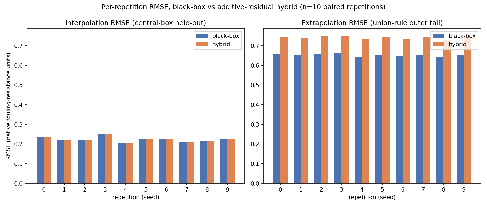

# Story Brief

> Written by the `story-brief` skill before `lit-review`, and revised at every
> later stage. This is a **hypothesis document, not a plan**: when the evidence
> contradicts a line here, the line changes — never the evidence.
>
> Fill the narrative slots as evidence arrives. `Context`, `Gap`, and `Question`
> come first, before any literature search. `Approach` follows the methods.
> `Finding` and `Implication` stay unfilled until `data/processed/` exists.

## Narrative

One sentence per slot. If a slot needs two sentences, the argument is not yet
sharp enough.

| Slot | Sentence |
|---|---|
| Context | Fouling in shell-and-tube heat exchangers used across power and process industries progressively degrades heat-transfer performance and raises energy consumption, so operators need fouling-resistance models accurate enough to schedule cleaning before the loss becomes costly. |
| Gap | In a controlled simulation study, we find no work that evaluates a physics-informed hybrid model against a capacity-matched purely data-driven model under an explicit operating-condition train/test split for shell-and-tube fouling-resistance prediction; validating any such advantage against measured fouling data is left to future work. |
| Question | For shell-and-tube heat exchanger fouling resistance simulated by a mechanistic fouling model, does embedding a physics-based fouling correlation inside a machine-learning surrogate lower RMSE on operating conditions held outside the training envelope, compared to a capacity-matched purely data-driven model? |
| Approach | _입력 필요_ |
| Finding | _입력 필요_ |
| Implication | _입력 필요_ |

## Claims

Every load-bearing statement the paper makes, with what currently backs it.

- `assumed` — believed but not yet backed. **May not be stated as fact in
  Results, Discussion, or Conclusion.**
- `supported` — backed by the listed evidence.
- `refuted` — the evidence went the other way. Rewrite the narrative slot that
  depended on it; the claim stays here as a record.

Evidence entries are comma-separated and take one of three forms:

| Form | Meaning | Checked against |
|---|---|---|
| `@key` | a registered source | `docs/notes/retrieved-sources.json` |
| `run:<run-id>` | an experiment run | `data/processed/<run-id>.manifest.json` |
| `Fig. N` / `Table N` | a figure or table in this paper | the section that renders it |

| ID | Claim | Status | Evidence |
|---|---|---|---|
| C0 | The correlation embedded in the hybrid model is a published literature fouling correlation (registered as `@key` in `docs/notes/retrieved-sources.json`, chosen independently of the simulator's implementation), and the simulator adds at least one mechanism this correlation omits (e.g. time-varying deposition/removal kinetics, temperature-dependent thermophoretic transport, or an induction period), so the residual term has real work to do rather than the correlation alone already explaining the data to within noise. | assumed | |
| C1 | The black-box (purely data-driven) model's median extrapolation RMSE — evaluated on conditions held out by the union rule (Reynolds number OR bulk fluid temperature in the outer 20% tail of the simulated range; the central 60%x60% box used for training and for the interpolation-test split below) — is at least 1.5x its median interpolation RMSE (a held-out 20% split drawn from the central box), across 10 repetitions varying weight initialization, the in-envelope train/interpolation-test partition, and the noise draw. The simulated dataset spans at least 2,000 operating points; RMSE is computed in the simulator's native fouling-resistance units, identical across models. | assumed | |
| C2 | The hybrid model — trainable-parameter count matched to the black-box model within 10%, tuned over an identical hyperparameter-search budget (same trial count; same tuned dimensions: learning rate, hidden width/depth, regularization strength, over identical ranges) — achieves a median extrapolation RMSE at least 10% lower than the black-box model's, and is lower in at least 8 of the 10 repetitions (paired Wilcoxon signed-rank test, p < 0.05). Contingent on C0: if C0 is refuted, C2 cannot be reported as `supported` regardless of the RMSE comparison, since the residual would not be doing genuine work. | assumed | |
| C3 | The hybrid model's median interpolation RMSE (same held-out central-box split as C1) does not exceed the black-box model's median interpolation RMSE by more than 10% relative. Contingent on C0, as with C2. | assumed | |

## Falsifiers

What result would force each claim to be rewritten. Written *before* the
experiment, not after.

- **C0:** Refuted if, with the residual term fixed at zero, the embedded correlation's extrapolation RMSE is already at or below 1.1x the added-noise standard deviation (Gaussian noise, sigma = 2% of the simulated fouling-resistance range, drawn independently per seed) — i.e. the correlation alone already explains the data to within the noise floor and the residual has no real work to do.
- **C1:** Refuted if the black-box model's median extrapolation RMSE (union-rule split defined above) is below 1.5x its median interpolation RMSE across the 10 repetitions. If refuted, this is reported directly as a negative result — extrapolation is not harder for the black-box model in this design — rather than re-drawing the split to manufacture a gap; C2 and C3 are then reported as uninterpretable rather than supported or refuted, since the premise that extrapolation is hard does not hold.
- **C2:** Refuted if the hybrid's median extrapolation RMSE is not at least 10% lower than the black-box's, or if the paired Wilcoxon signed-rank test across the 10 repetitions does not reach p < 0.05.
- **C3:** Refuted if the hybrid's median interpolation RMSE exceeds the black-box's median interpolation RMSE by more than 10% relative.

## Section coverage

Each section declares the claims it carries with a single comment line placed
directly under its heading:

```markdown
<!-- claims: C1, C3 -->
```

`scripts/verify_story_brief.py` cross-checks those declarations against this
ledger, so a claim cannot quietly drift out of the paper — or into the
conclusion while still `assumed`.

Written prose requires exactly one nonempty declaration. Empty template headings
and HTML drafting notes are allowed before drafting, but not at final review.
The critic must also compare actual prose with its declarations; structural
checks cannot prove that the scientific argument is sound.

## Evidence format

Source evidence requires a readable registry containing the key. A run requires
`data/processed/<run-id>.manifest.json` with matching `run_id`, an existing `code/`
script, command, integer or null `random_seed`, Python/package versions, and
nonempty lists of existing project-relative input and processed output files.
An empty or malformed manifest is not evidence. The checker does not execute it;
the experiment review must verify reproducibility separately.

Figure and table evidence refers to a caption immediately followed by its object
in a manuscript section. Caption labels are unique across the manuscript. For a
section under `docs/sections/`, use:

```markdown
Fig. 1: Measured efficiency


Table 1: Comparison
| Method | Efficiency |
|---|---|
| Baseline | 0.8 |
```

The image must be a nonempty local file inside the project; the table must have
a header, separator and data row. Mentioning `Fig. 1` in prose is insufficient.
Every written claim needs a written falsifier, including `assumed` claims. Keep
the approved pre-experiment version in Git; the validator cannot prove when a
falsifier was written. A written `Finding` needs run evidence in the claims ledger.

Use `--state .omc/paper-state.md` to apply requirements for approved stages,
`--check-manifests` after experiments, and `--require-slots all --require-coverage`
at final review. Run these checks from the project root.
